# Sagemaker CI/CD Pipeline

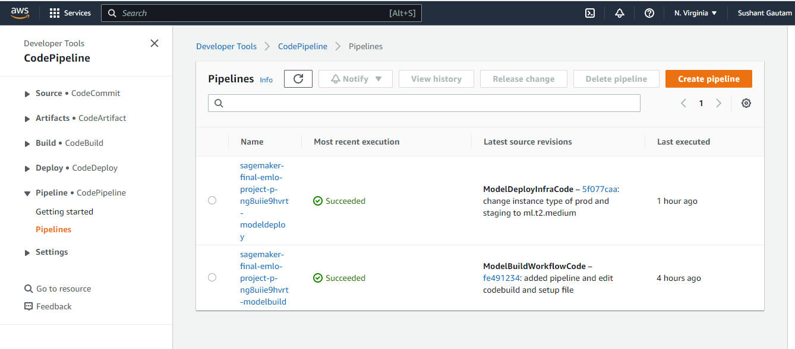

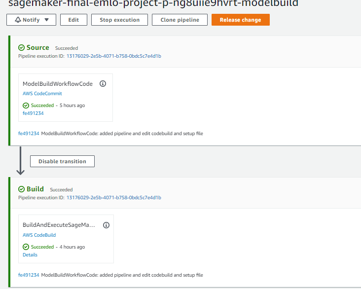

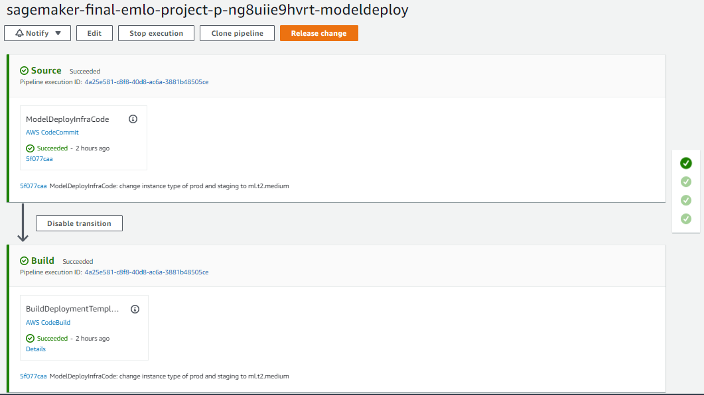

Finally, the deployed endpoints
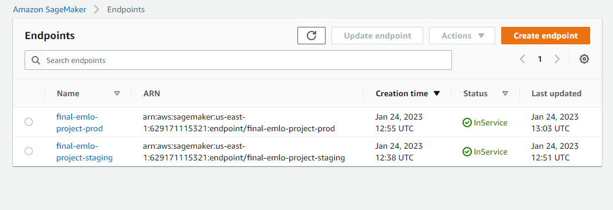

Pipeline in sagemaker studio looks like after approval. There are different test and trial projects and their pipelines but this is the final one:
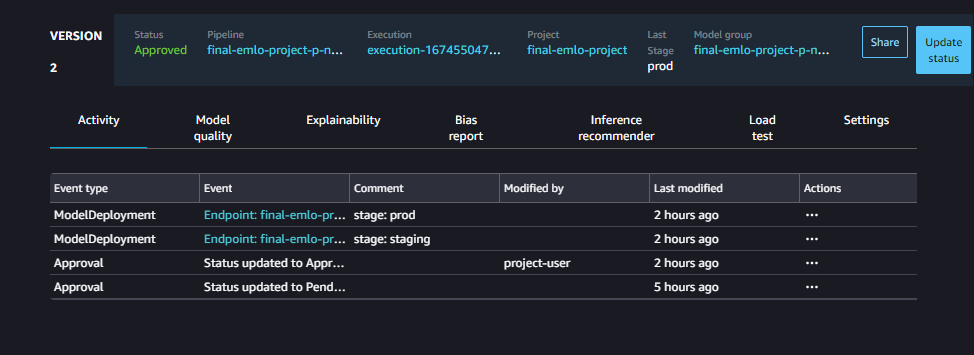


#### How it trigger pipeline : Upload input dataset
When upload input dataset as zip format : `intel.zip` it triggers current CI/CD pipeline. I will explain about Automatically trigger a SageMaker Pipeline using EventBridge to create trigger rules and CloudTrail to capture S3 object-level events.
Following are the steps I followed to make it happen:
* I follow [this](https://awstip.com/how-to-automatically-trigger-a-sagemaker-pipeline-using-eventbridge-3b71829a9e5) tutorial step-by-step.
1. Configuring trail for S3 object-level events on CloudTRail:

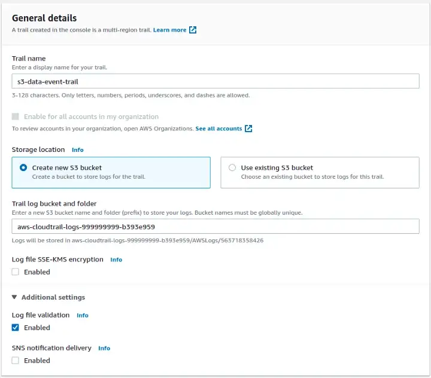

2. I use put object as eventname:

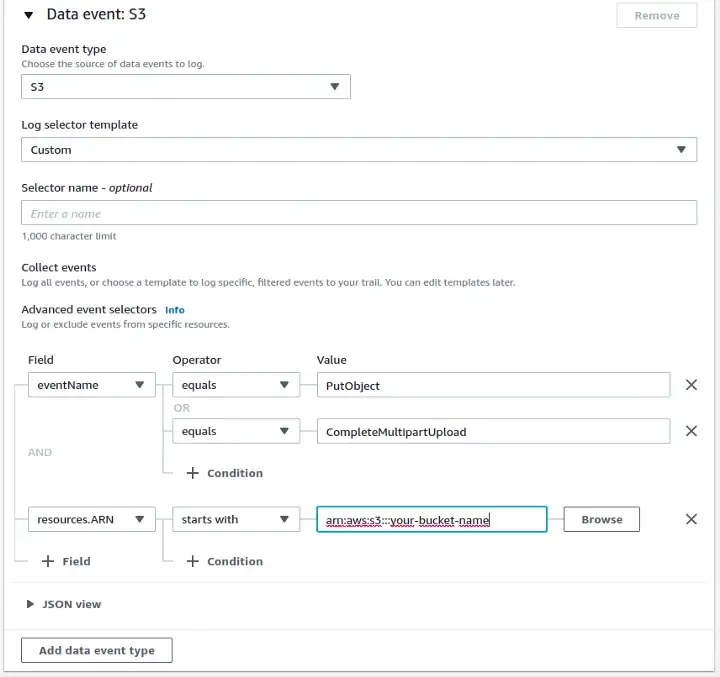

3. Then, Create a data rule on EventBridge

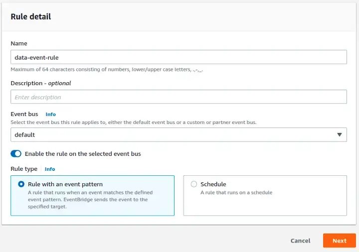

4. For the event pattern I use following json  to capture object level events with cloudTrial:
```json
{
  "source": ["aws.s3"],
  "detail-type": ["AWS API Call via CloudTrail"],
  "detail": {
    "eventSource": ["s3.amazonaws.com"],
    "eventName": ["PutObject", "CompleteMultipartUpload"],
    "requestParameters": {
      "bucketName": ["arn:aws:s3:::sagemaker-us-east-1-input-data"],
      "key": [{
        "prefix": "intel.zip"
      }]
    }
  }
}
```
5. Finally, On the Target screen, keep AWS Services selected, I select SageMaker Pipeline.

With these steps whenever I uploaded new intel.zip in the `sagemaker-us-east-1-input-data` it triggers the pipeline which I select in target.
My event-bridge looks like: 
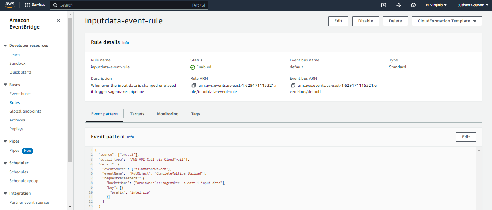

#### Trigger pipeline : Upload Annotation dataset
Similar above steps are followed and whenever any file is uploaded in `annotation_data` folder of the `sagemaker-us-east-1-annotation-data`, it trigger the pipeline. Here event-bridge is enough since we are not monitoring specific object level event. I follow [Good AWS Blog](https://aws.amazon.com/blogs/aws/new-use-amazon-s3-event-notifications-with-amazon-eventbridge/) for this.
Here I not use Cloud Trial, i just check if any object is created or restored in `sagemaker-us-east-1-annotation-data` bucket in `annotations/` subfolder as:

```json
{
  "source": ["aws.s3"],
  "detail-type": ["Object Created", "Object Restore Completed"],
  "detail": {
    "bucket":{
      "name": ["sagemaker-us-east-1-annotation-data"]
    },
    "object": {
      "key" : [{"prefix" : "annotations/"}]
      }
  }
}
```

After that I select the current sagemaker pipeline to start:
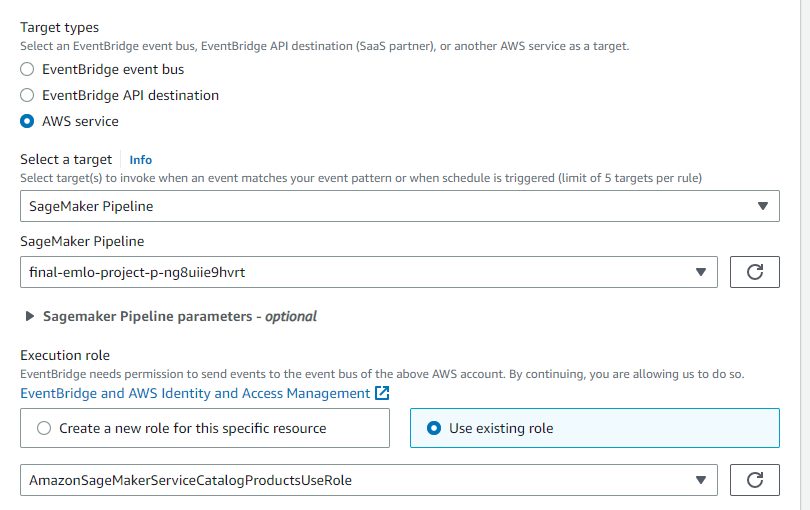


So, there are altogether 5 event bridge rules to complete the task:
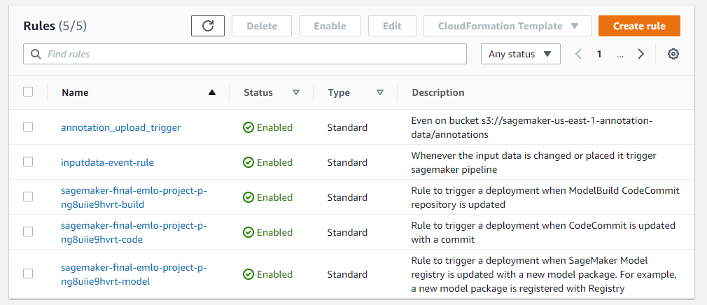
### Deployment and Drift Detection - Online Drift detection
I use online drift detection called `MMDDriftOnline`. Here is some important code is given below that helps to find drift statistics.
Full code is available at [sagemaker-projectv1-intel-modelbuild/pipelines/intel/scripts/infer.py](sagemaker-projectv1-intel-modelbuild/pipelines/intel/scripts/infer.py)
```python
# ...
from alibi_detect.cd import MMDDriftOnline
transform = T.Compose([T.ToPILImage(),
                       T.Resize((224, 224)),
                       T.ToTensor(),
                       T.Normalize(mean=[0.485, 0.456, 0.406], std=[0.229, 0.224, 0.225])])

idx_to_class = {
    0: 'buildings', 1: 'forest', 2: 'glacier', 3: 'mountain', 4: 'sea', 5: 'street'
}

dd = MMDDriftOnline(x_ref, ERT, W, backend='pytorch')
# ....
# inference
def predict_fn(input_object, model):
    with torch.no_grad():
        prediction = model(input_object)
        prediction = F.softmax(prediction, dim=1)

    confidences, cat_ids = torch.topk(prediction, 5)
    outputs = {
        idx_to_class[idx.item()]: c.item() for c, idx in zip(confidences[0], cat_ids[0])
    }
    logging.info("::Model Output:: {}".format(outputs))

    ######### DRIFT DETECTION #################
    # image with no batch dimension ; [1, C, H, W] => [C, H, W]
    input_object = input_object.squeeze(0)
    logging.info("Shape after squeeze: {}".format(input_object.shape))
    drift_preds = dd.predict(np.array(input_object), return_test_stat=True)
    print("####################################################################")
    logging.info("::Dift statistics:: {} ".format(drift_preds))
    print("::Dift statistics:: {} ".format(drift_preds))
    print("####################################################################")
    # return outputs
    return outputs

```

You can see the detail experiment on drift detection on this 


**Deployment Test on some test images**
The result in [notebooks/05-test-staging.ipynb](notebooks/05-test-staging.ipynb)

**Output Logs**
Here is screenshot of output logs during prediction on cloud watch:
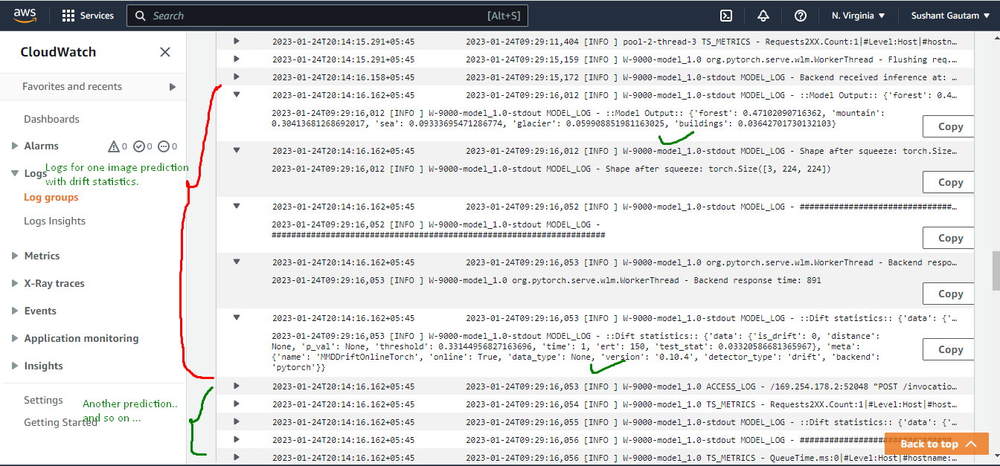


## Complete Project diagram


It can be downloaded from [here](files/tsai_emlov2-project_file.drawio.png)